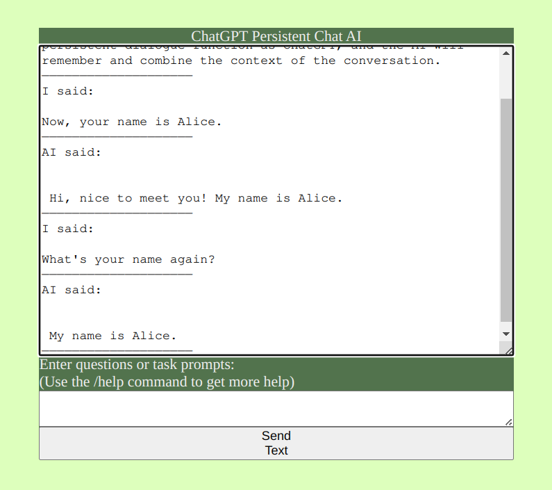

# ChatGPT.js

#### Indroduction
A ChatGPT chat interface written in native JavaScript, based on the openai GPT-3 API interface, with added memory context dialogue, making AI conversations more natural, with special means to prevent it from "talking back" to achieve a similar sustained dialogue effect to the official website ChatGPT. 

#### Software architecture 
Javascript HTML CSS

#### Installation
1. Clone the full project to the computer
2. Double click the index.html file 
3. Start the browser to run

#### Instructions for use:
1. An openai apikey is required in order to use this page properly.
2. Native JavaScript deployment directly to static web hosting platform.
3. Type "/help" in the input box to view supported commands which can be used to modify parameters to adjust AI behavior:
- /help (to view help information)
- /apikey (OpenAI API key to authenticate the API request. Get from https://platform.openai.com/account/api-keys)
- /prompt (to add prior context to each text sent)
- /maxtoken (to control the number of words ChatGPT can generate each time.)
- /tpr (control the diversity of chatbot's response. Higher values means the model will take more risks. Try 0.9 for more creative applications, and 0 for ones with a well-defined answer.)
- /top (An alternative to sampling with temperature, called nucleus sampling, where the model considers the results of the tokens with top_p probability mass. So 0.1 means only the tokens comprising the top 10% probability mass are considered. It is generally recommended to alter this or temperature but not both.)
- /fp (Frequency_penalty, number between -2.0 and 2.0. Positive values penalize new tokens based on their existing frequency in the text so far, decreasing the model's likelihood to repeat the same line verbatim.)
- /pp (Presence_penalty, number between -2.0 and 2.0. Positive values penalize new tokens based on whether they appear in the text so far, increasing the model's likelihood to talk about new topics.)
- /info (to display the current values of various parameters)
- /mode (to set whether to enable continuous dialog mode)

4. After entering /info, the values of all parameters will be displayed:

Since the principle of this project to enable continuous dialog is to also send the previous historical dialog content to the GPT-3 interface, it will lead to the wastage of account quota. You can type "/mode" in the console and enter "false" in the input box to turn off continuous dialog mode.

#### Other
Using the prompt parameter to reasonably set the prior context for each sentence can not only maintain consistent tone and character of the AI in the long run, but also ensure that key information is not forgotten by the AI.
Part of the code in this project is generated by ChatGPT.
This document is translated with the assistance of ChatGPT.

#### Contribute
1. Fork this repository
2. Create a Feat_xxx branch
3. Submit code
4. Create a Pull Request

#### Note
Using the prompt parameter to set the contextual information for each sentence can help maintain the tone and personality of the AI over the long term, and can also prevent important information from being forgotten by the AI.

Some of the code in this project was generated by ChatGPT.
